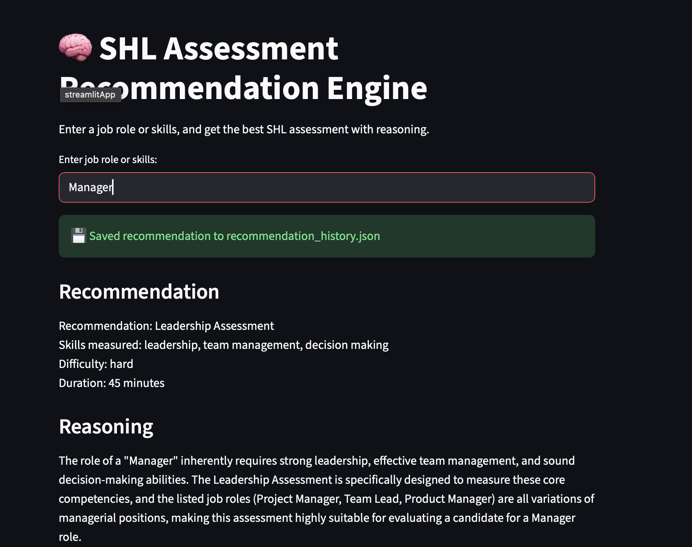
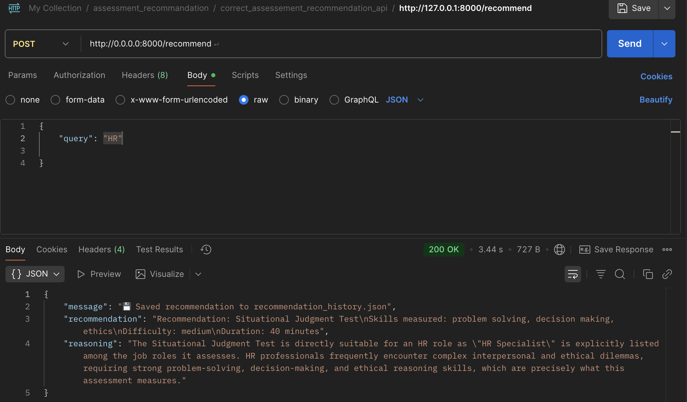
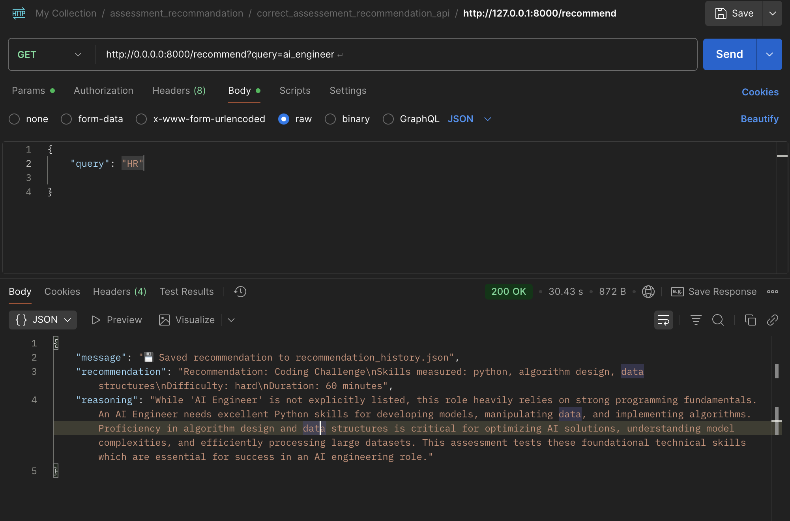

# 🧠 Assessment Recommendation Engine
An **AI-powered recommendation** system that suggests the most relevant **assessments** for a given job role or skills.
Built using **FastAPI, LangChain, and HuggingFace Embeddings**, this engine processes your assessment catalog and uses vector similarity search to return intelligent recommendations.



## 🚀 Features
-  FastAPI backend with REST endpoints
-  LangChain + Chroma vector store integration
-  Uses sentence-transformers/all-mpnet-base-v2 for semantic similarity
-  JSON or text-based assessment data support
- ️ Easily deployable on Render, AWS, or Railway
-  Context-aware search for relevant skill/role matches

## 🛠️ Tech Stack
- **FastAPI** (Backend)
- **LangChain** (RAG pipeline)
- **ChromaDB** (Vector Database)
- **Hugging Face Embeddings**
- **Google Generative AI (Gemini)**

## 📦 API Endpoints

### `POST /recommend`
Add a new assessment to the vector database.



### `GET /recommend?query=skills_or_role`
Retrieve the most relevant assessments based on input query.

Example:

GET /recommend?query=ai+engineer



---

## 🧩 Local Development

### 1. Install dependencies
```bash
pip install -r requirements.txt


---

Run server
uvicorn server:app --reload


